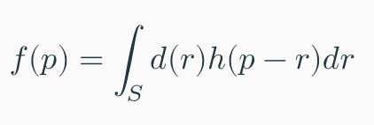
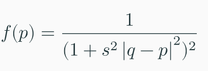

# Render Convolution Surfaces using Ray Marching
This code shows an implementation of ray marching to render convolution surfaces. 

A convolution surface is defined by a distance function *d* and a filter kernel *h*.

By using analytical kernel functions, a direct analytic solution to the convolution integral can be calculated:

This example shows a skeleton with two point primitives. The normal vectors are estimated using forward differences.

Result:

# References
Bloomenthal, J. and Shoemake, K. 1991. Convolution surfaces. SIGGRAPH Comput. Graph. 25, 4 (July 1991), 251–256. DOI:https://doi.org/10.1145/127719.122757

Sherstyuk, A. 1999. Interactive shape design with convolution surfaces. Proceedings of the international conference on shape modeling and applications, IEEE Computer Society, 56.
